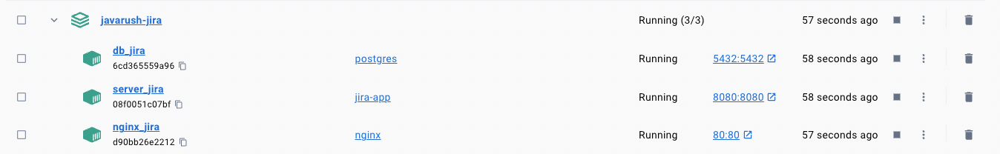
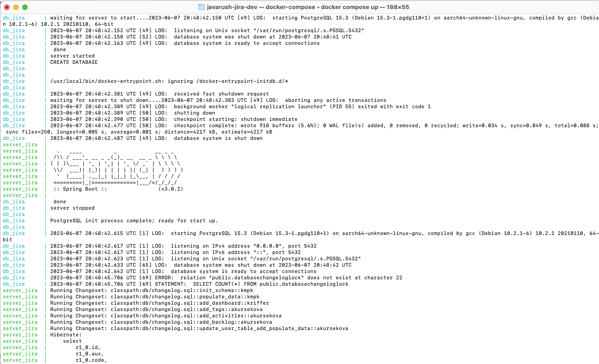
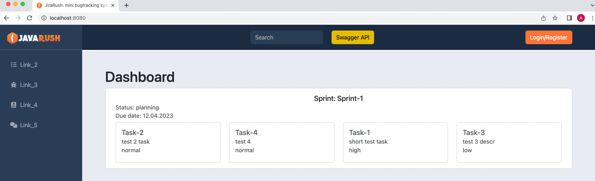
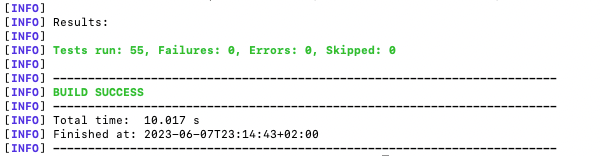

## [REST API](http://localhost:8080/doc)

## Concept:
- Spring Modulith
  - [Spring Modulith](https://habr.com/ru/post/701984/)
  - [Introducing Spring Modulith](https://spring.io/blog/2022/10/21/introducing-spring-modulith)
  - [Spring Modulith - Reference documentation](https://docs.spring.io/spring-modulith/docs/current-SNAPSHOT/reference/html/)

```
  url: jdbc:postgresql://localhost:5432/jira
  username: jira
  password: JiraRush
```
- There are 2 common tables that don't have fk
  - _Reference_ - directory. We make the connection by _code_ (we cannot check by id, because id related with environment-particular database)
  - _UserBelong_ - binding users with type (owner, lead,...) to an object (task, project, sprint,...). FC will be checked manually

## Analogs
- https://java-source.net/open-source/issue-trackers

## Testing
- https://habr.com/ru/articles/259055/

## Run and Build the code using Docker

- Install [Docker](https://docs.docker.com/install)
- Open the link https://github.com/akursekova/javarush-jira/tree/dev and click Donwnload ZIP
- The name of downloaded folder will be javarush-jira-dev, since it was downloaded from the dev branch
- Add .env file with sensitive info (it was not committed due to security reasons)
- run following commands
 ```
 cd trading-platform-dev 
 mvn clean package -DskipTests
 docker-compose up
 ```




Application will be available at http://localhost:8080/:


Run tests: 
 ```
mvn clean test -DHOST_URL=http://localhost:8080 
-DAPP_MAIL=jira4jr@gmail.com 
-DDB_URL=jdbc:postgresql://localhost:5432/jira 
-DDB_USERNAME=jira 
-DDB_PASSWORD=JiraRush 
-DDB_DRIVER=org.postgresql.Driver 
-DMAIL_USERNAME=jira4jr@gmail.com 
-DMAIL_PASSWORD=zdfzsrqvgimldzyj
 ```


## List of completed tasks:
#### 1. Code related to social networks(vk, yandex) was deleted:
- login.html
- register.html
- application.yaml
- YandexOAuth2UserDataHandler.java
- VkOAuth2UserDataHandler.java

#### 2. Sensitive information from application.yaml was moved to .env file, values were replaced by placeholders:
```
Example:
  datasource:
    url: ${DB_URL}
    username: ${DB_USERNAME}
    password: ${DB_PASSWORD}
    driverClassName: ${DB_DRIVER}
```

#### 3. Tests refactoring. To use in memory database (H2) instead of PostgreSQL:
- added com.h2database to the pom.xml
- added DataSourceConfig class with 2 Beans definition: prodDataSource for "prod" profile and testDataSource for "test" profile  
Properties should be taken from application.yaml, application-test.yaml accordingly
- application.yaml: added driverClassName: org.postgresql.Driver
- application-test.yaml: added spring.jpa, spring.datasource, spring.liquibase properties
- actualized test.sql:  
  - added scripts for tables creation, 
  - 'delete from table' was replaced with 'drop table', because initially H2 doesn't have any table to be dropped.
  - For users and reference tables 'auto_increment' parameter was added.  
  Tests related with creation of these entities were failing without this parameter.
#### 4. All public methods of the ProfileRestController controller was covered by tests:
- ProfileRestControllerTest.java was created
- Following tests were added:
  - getUserProfile()
  - getAdminProfile()
  - getUnauthorized()
  - update_addEmailNotificationsAndContacts_shouldReturnNoContent()
  - update_addInvalidContact_shouldReturnIsUnprocessableEntity()
  - update_addInvalidEmailNotification_shouldReturnIsUnprocessableEntity()
- Added utility class ProfileTestData with preconfigured data which was used in ProfileRestControllerTest

#### 5. Added new functionality of adding tags to tasks:
- added new class TaskTagsTo which has only 2 fields: id (which corresponds to task id) and tags.  
The purpose of this class is a serialization from JSON to Task object.
- added TaskTagMapper class which does mapping from TaskTagsTo to Task and vise-versa
- added TaskRestController, AbstractTaskController classes with method update, which receives TaskTagsTo object and update corresponding Task object accordingly.
- updated changelog.sql file with new changeset:
  - added new ref_type 8 which corresponds to TAG
  - insertion of tags to the reference table.
- updated RefType class with new type, which corresponds to TAG (8)
- added TaskUtil class with the method, which checks if the tag from request body exists in the database or not

#### 6. Added the ability to subscribe to tasks which are not assigned to the current user:

I used the following logic for implementation:
- If user start to follow a task, new record should be added to the user_belong table  
- if user stops to follow the task, corresponding record will be deleted from user_belong table  

Following changes made: 
- added two new methods to TaskRestController:
  - subscribe: method creates new record in user_belong table 
  - unsubscribe: method deletes corresponding record from user_belong.
- UserBelong class updated, added @AllArgsConstructor annotation
- added native query to UserBelongRepository, which returns id of the user_belong record by unique combination of user_id, task_is, user_type_code and object_type.  

Previously there was no way to define user_type_code by user_id.  
There is a new field typeCode in User class, which reflects type code of each user.  
There is a possibility to get this code by user_id.  
Following changes were made in order to improve this situation:
- User class: added new class field typeCode, constructors updated accordingly
- CustomOAuth2UserService, loadUser() method updated accordingly, added user type code to the constructor
- Added new method checkUserTypeCodeExist() to the ValidationUtil. The purpose of the method is to check if admin creates user with correct user code. Method comparing given type code with the type codes from reference table
- AbstractUserController updated: added checkUserTypeCodeExist() method to the update() method
- AdminUserController updated: added checkUserTypeCodeExist() method to the createWithLocation() method
- TaskRestController: since now there is a relation between user_id and type_code, now I take corresponding type code by user_id and set it to the user belong constructor
- AdminUserControllerTest: creation of new user updated, added type code
- UserTestData: test data updated accordingly
- changelog.sql, test.sql changelogsL added new column to user table, existing users updated with corresponding type codes

#### 7. Added automatic calculation of the time how long the task was in work and testing.
- Created ActivityService class in order to support methods on service level
- Added two methods calculateDurationBetweenInProgressAndReady and calculateDurationBetweenReadyAndDone.  
Methods get as an argument the task and return object of Optional<Duration>.  
In case if there is no corresponding record in activity class, the method will return Optional.empty() and controller which will use this method will need to check if the result is empty or not.
- ActivityRepository class was updated with the method findTaskTimestampByTaskAndStatus, which returns Optional<LocalDateTime>.  
If corresponding record was not found in the Activity table, returned value will be empty Optional.
- added new changeset to the changelog.sql: added activities to the activity table.

#### 8. Added localization for ru, en and es for email templates and index.html start page:
- added messages_en.properties, messages_es.properties, messages_ru.properties files with corresponding localizations
- added @beans LocaleResolver, MessageSource, LocaleChangeInterceptor to the MvcConfig class in order to support i18n
- default locale set to english in localeResolver()
- updated method getContent() in the MailService, which was setting hardcoded russian locale to the context.  
Instead of that, not it takes current locale, using LocaleContextHolder.
- html pages were updated accordingly
- LocaleChangeInterceptor is registered as an interceptor in MvcConfig class.  
It gives ability to localize html pages, by adding /?locale=es or any other locale

#### 9. Implement backlog with paging (back + front):
- added BacklogUIController with the method getBacklog, which searches for all tasks which don't have Sprint specified and pass to front the information about tasks per page and amount of pages
- added backlog.html to display all the tasks in backlog
- updated sidebar.html: added backlog.html there, now backlog.html displays when clicking Folder button on the sidebar
- updated TaskRepository: added two new methods
  - getAllWithNonEmptySprint, which searches for all tasks which have sprint specified
  - getAllWithEmptySprint, which searches for all tasks which don't have sprint specified (backlog)
- updated TaskService: added getAllWithNonEmptySprint() method, which get all tasks with no sprint specified
- updated method getAll from the DashboardUIController accordingly
- tasks with no sprint modified added to chnagelog.sql for testing purposes
- updated messages.properties files, added localisation for 'Backlog'

#### 10. Add Dockerfile: 
- Dockerfile added to the root of the project

#### 11. Add docker-compose.yaml:
- docker-compose.yaml added to the root of the project  


